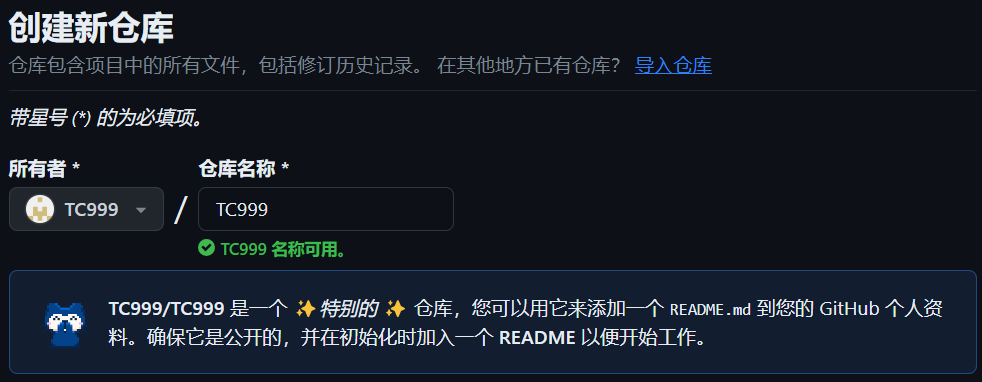
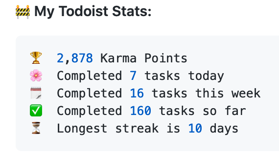
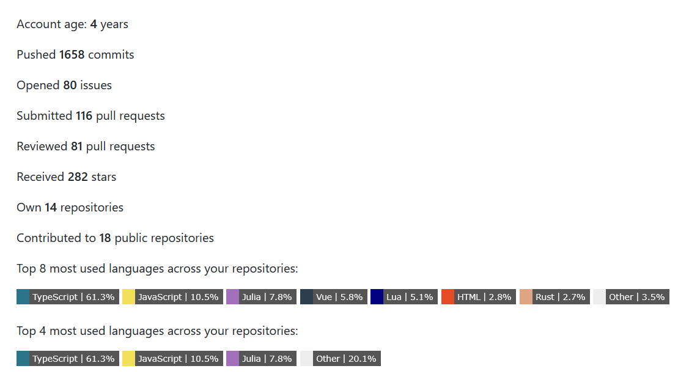
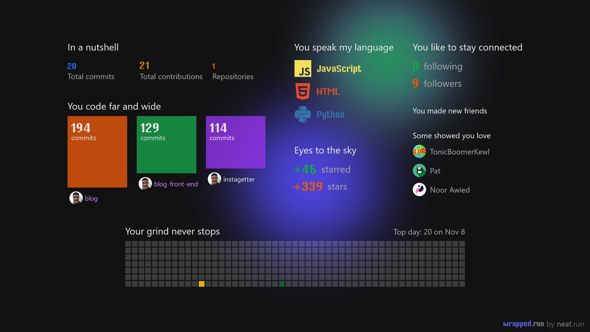
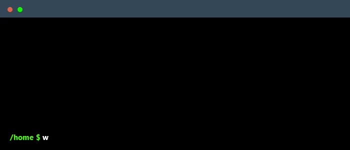

 &nbsp;  &nbsp; 

       

---

# 你好朋友 🖐️

你好吗？如果你想要让你的GitHub个人资料更漂亮，你来对地方了

# 📖 目录

- [📌 第一步：设置GitHub仓库](#-📌-第一步：设置GitHub仓库-)
- [💡 我们从哪里获取灵感？](#💡-我们从哪里获取灵感？-)
- [🚩 看完这些个人资料后，我们该怎么做？](#🚩-看完这些个人资料后，我们该怎么做？)
  - [🧩 徽章 ](#🧩-徽章-👇)
  - [🛠️ 小部件 ](#🛠️-小部件-👇-)
  - [✅ 图标 ](#-✅-图标-👇-)
  - [⚙️ 个人资料生成器 ](#-⚙️-个人资料生成器-👇-)
  - [😉 表情符号 ](#-😉-表情符号-)
- [点亮一颗星 ⭐](#-点个星-⭐-)

# 📌 第一步：设置GitHub仓库

用您的GitHub用户名创建一个仓库 👇

- 注：下图使用了[Github中文化插件](https://github.com/maboloshi/github-chinese)
 

 

模板 : 👇

    https://github.com/username/username

示例 : 👇

    https://github.com/rzashakeri/rzashakeri

### 创建仓库后，**在仓库中创建一个README.md**，然后完成 ✅

既然我们已经建立了仓库，我们来到了有趣的部分：**设计我们的README.md.**

> 第一步的波斯语指南 👉 [链接 🔗](https://www.instagram.com/p/CQlxnAnHId0/)

# 💡 我们从哪里获取灵感？

你一定被问到从哪些个人资料中获取灵感了吧？你可以通过以下网站查看不同人的资料，并从中获取灵感 👇

### [🔗 令人敬畏的GitHub个人资料 ](https://zzetao.github.io/awesome-github-profile/)

# 🚩 看完这些个人资料后，我们该怎么做？

好了，到目前为止，你已经从不同人的个人资料中找到了一些酷炫的想法。现在是时候使用不同的工具美化你的GitHub个人资料了，你可以从下面的列表中访问这些工具。

## 🧩 徽章 👇

#### 1 . [Markdown中的徽章列表](https://github.com/Naereen/badges)

包含其Markdown代码的徽章和卡片列表，可包含在GitHub的README.md文件中。

📍 例如 : &nbsp;  &nbsp;  &nbsp;  &nbsp; 

#### 2 . [Markdown中许多不同类别的徽章 ](https://github.com/Ileriayo/markdown-badges)

用于个人开发者品牌、个人资料和项目的徽章。
 
 

📍 例如 : &nbsp; 

 &nbsp;  &nbsp;  &nbsp; 
 
 

#### 3 . [查看次数徽章](https://github.com/dwyl/hits)

一种计算Markdown文件上查看次数的徽章生成器服务。

📍 例如 : &nbsp; 

 
 

#### 4 . [shields](https://shields.io/)

简洁、一致和清晰的SVG和光栅徽章，以及使用自定义值制作令牌。

📍 例如 : &nbsp; 

 &nbsp;  &nbsp; 
 

#### 5 . [laravel github个人资料查看计数器](https://github.com/caneco/laravel-github-profile-view-counter)

此软件包将允许您跟踪GitHub个人资料的查看次数，并在您的个人资料自述中显示它们，而且是免费的。

#### 6 . [Stackoverflow徽章](https://github.com/claytonjhamilton/stackoverflow-badge)

使用此独特的StackOverflow徽章显示您的统计信息

📍 例如 : &nbsp; 

 
 

#### 7 . [Github README YouTube统计](https://github.com/DenverCoder1/github-readme-youtube-stats)

用于GitHub个人资料自述的Youtube统计徽章。显示您的频道的订阅者总数或视图次数。

📍 例如 : &nbsp;

  &nbsp; 
 
 

#### 8 . [GitHub徽章](https://github.com/Envoy-VC/Badges-for-GitHub)

GitHub中使用的徽章的精选列表
 
 
📍 例如 : &nbsp;  &nbsp;  &nbsp; 
 
 

#### 9 . [README.md个人资料的徽章4](https://github.com/alexandresanlim/Badges4-README.md-Profile)

使用这些惊人的徽章改进你的README.md个人资料。

📍 例如 :
 
 
  
 
 

#### 10 . [Gitwar](https://github.com/iampavangandhi/Gitwar)

Gitwar - 与GitHub竞争，检查你的GitHub得分。基于 - 您的公共仓库，公共仓库上的星星，公共仓库上的分叉，GitHub关注者，加入的GitHub组织...

📍 例如 :
 
 

 
 
 

#### 11 . [GitHub个人资料查看计数器](https://github.com/antonkomarev/github-profile-views-counter)

它统计了您的GitHub个人资料被查看的次数。免费的云微服务。

📍 例如 :
 
 
 &nbsp; 
 
 

#### 12 . [ColoredBadges](https://github.com/MikeCodesDotNET/ColoredBadges)

我为GitHub个人资料制作的一些徽章。

📍 例如：
 
 
  
 
 

#### 13 . [AppVeyor](https://www.appveyor.com/docs/status-badges/)

项目状态徽章是一个动态生成的图像，显示最后构建的状态。您可以将状态徽章放置在GitHub项目或内部门户的主页上：

📍 例如：
 
 
 

#### 14 . [For The Badge](https://github.com/BraveUX/for-the-badge)

徽章为了徽章而生。

📍 例如：
 
 

#### 15 . [Grunt Badge](https://gruntjs.com/built-with-grunt-badge)

您在项目中使用Grunt，并希望自豪地显示在项目的README或项目网站上吗？现在您可以使用“Built with Grunt”徽章！

📍 例如：

 

#### 16 . [semaphoreci Status Badges](https://docs.semaphoreci.com/essentials/status-badges/)

创建一个显示项目当前构建状态的徽章。构建状态由您最新工作流程中第一个流水线的状态确定。您可以在项目的README文件或任何网页中使用此徽章。

📍 例如：

#### 17 . [Aoc Badges Action](https://github.com/J0B10/aoc-badges-action)

GitHub Action，用于更新您的Readme徽章，显示您当前的Advent of Code统计信息。

📍 例如：

 

#### 18 . [Github Badges](https://github.com/eugustavo/github-badges)

用于为您的Readme创建徽章的应用程序 📑

📍 例如：

#### 19 . [Discord Md Badge](https://github.com/ashmonty/discord-md-badge)

在GitHub readme中添加一个徽章，显示您的Discord用户名和在线状态！

📍 例如：

#### 20 . [simple badges](https://github.com/developStorm/simple-badges)

在您喜爱的Shields.io徽章上使用令人惊叹的简单图标。今天就在您的个人资料上尝试吧！

📍 例如：

  

#### 21 . [GitHub Profile Badges](https://github.com/Aveek

-Saha/GitHub-Profile-Badges)

为您的GitHub个人资料Readme创建的清晰徽章。

📍 例如：

#### 22 . [Custom Icon Badges](https://github.com/DenverCoder1/custom-icon-badges)

允许用户更轻松地在shields.io徽章中使用Octicons以及他们自己的图标和标志。

📍 例如：

#### 23 . [pepy](https://github.com/psincraian/pepy)

pepy是一个获取有关任何Python包的统计信息的网站

📍 例如：

#### 24 . [Version Badge](https://badge.fury.io/)

一旦包的所有者将此徽章添加到其README文件中，它将通知并链接所有访问者到该包的最新版本。

📍 例如：

#### 25 . [Peerlist Profile Badge](https://github.com/vinitshahdeo/peerlist-readme-badge)

[Peerlist](https://peerlist.io/)是一个专注于建立个人品牌、分享专业内容并找到合作伙伴的工作专业人士社区。 [Peerlist个人资料](https://peerlist.io/vinitshahdeo) 可以用作简历或完整作品集，以展示您的工作。您可以使用令人惊叹的Peerlist markdown徽章装饰您的个人资料`README.md`。

📍 例如：

#### 26 . [hits](https://github.com/silentsoft/hits)

📈 GitHub或您想要的任何网站的访问计数器。

📍 例如：

#### 27 . [gradient badge](https://github.com/bokub/gradient-badge)

🍭 具有颜色渐变支持的徽章生成器

📍 例如：

#### 28 . [Topmate Profile Badge](https://github.com/vinitshahdeo/topmate-readme-badge)

Topmate是一个与观众1:1连接并更好地实现时间变现的平台。基本上，[一个链接](https://topmate.io/vinitshahdeo) 搞定一切。更好的是，您现在可以在GitHub个人资料README中添加一个markdown徽章，与您的社区连接！在这里尝试：[topmate-readme-badge.netlify.app](https://topmate-readme-badge.netlify.app/)

📍 例如：

#### 29 . [GitHub Profile Views Counter](https://github.com/u8views/go-u8views/)

跟踪您的GitHub个人资料访问量并分析统计数据。

📍 例如：

---

## 🛠️ 小部件 👇

#### 1 . [Todoist Readme](https://github.com/abhisheknaiidu/todoist-readme)

用用户的Todoist统计数据更新README
 

📍 例如： &nbsp;
 

 
 

#### 2 . [github readme stats](https://github.com/anuraghazra/github-readme-stats)

为你的GitHub README生成动态统计信息
 

📍 例如： &nbsp;
 

 
 

 
 

#### 3 . [GitHub Readme Streak Stats](https://github.com/DenverCoder1/github-readme-streak-stats)

保持动力，展示你的贡献连续！ 🌟 在你的GitHub个人资料README上显示你的总贡献、当前连续和最长连续
 

📍 例如： &nbsp;
 

 
 

#### 4 . [waka readme](https://github.com/athul/waka-readme)

在你的个人资料README上展示Wakatime每周指标。
 

📍 例如： &nbsp;
 

 
 

#### 5 . [Profile Activity Generator](https://github.com/omidnikrah/profile-activity-generator)

为你的个人资料README生成定制的活动信息

📍 例如： &nbsp;
 

 
 

#### 6 . [Github Activity Readme](https://github.com/jamesgeorge007/github-activity-readme)

用用户最近的GitHub活动更新README
 

📍 例如： &nbsp;
 

 
 

#### 7 . [Github Action Dynamic Profile Page](https://github.com/umutphp/github-action-dynamic-profile-page/)

GitHub Action，用于将更新推送到你的特殊个人资料仓库。
 

📍 例如： &nbsp;
 

 

#### 8 . [waka readme stats](https://github.com/anmol098/waka-readme-stats)

这个GitHub动作可以在你的GitHub资料README中添加酷炫的开发指标
 

📍 例如： &nbsp;
 

 
 

#### 9 . [Profile Readme](https://github.com/actions-js/profile-readme)

在你的个人资料README.md中显示个人活动和其他酷炫的小部件
 

📍 例如： &nbsp;
 

💪 提交了PR #43到webview/webview_deno 
❗️ 关闭了denosaurs/denon的问题 #32 
🗣 在nestdotland/hatcher的问题 #6上发表评论 
❗️ 关闭了nestdotland/eggs的问题 #22 
🗣 在nestdotland/eggs的问题 #15上发表评论 
 
 

#### 10 . [Spotify Github Profile](https://github.com/kittinan/spotify-github-profile)

在你的Github个人资料上显示你的Spotify播放情况
 

📍 例如： &nbsp;

 

 
 

#### 11 . [Blog Post Workflow](https://github.com/gautamkrishnar/blog-post-workflow)

在GitHub个

人资料/项目README上自动显示你的最新博客文章、StackOverflow活动或YouTube视频，使用RSS feed
 

📍 例如： &nbsp;

 
 

#### 12 . [Github Readme Medium](https://github.com/omidnikrah/github-readme-medium)

在你的GitHub README中动态生成你的最新Medium文章！
 

📍 例如： &nbsp;

 

#### 13 . [Github Readme Stackoverflow](https://github.com/omidnikrah/github-readme-stackoverflow)

在你的GitHub README上动态生成你的StackOverflow状态！
 

📍 例如： &nbsp;

 

 
 

#### 14 . [Profile Readme Stats](https://github.com/teoxoy/profile-readme-stats)

在你的个人资料README.md上展示你的GitHub统计信息
 

📍 例如： &nbsp;

#### 15 . [Readme Jokes](https://github.com/ABSphreak/readme-jokes)

😄 为你的GitHub README提供笑话
 

📍 例如： &nbsp;

 

 
 
 
 
 
 
 
 

#### 16 . [Github Profile Trophy](https://github.com/ryo-ma/github-profile-trophy)

在你的README上添加动态生成的GitHub Stat奖杯
 

📍 例如： &nbsp;

 
 

#### 17 . [Github Readme Twitter](https://github.com/gazf/github-readme-twitter)

在你的GitHub README上添加Twitter
 

📍 例如： &nbsp;

 
 

#### 18 . [Random Memer](https://github.com/techytushar/random-memer)

返回从Memedroid抓取的随机笑话图片
 
 

#### 19 . [Readme Pagespeed Insights](https://github.com/ankurparihar/readme-pagespeed-insights)

你网站的Google Lighthouse统计数据，可以放在README中

📍 例如： &nbsp;

 

 
 

#### 20. [REHeader](https://github.com/khalby786/REHeader)

为GitHub个人资料的README生成漂亮的头图。

📍 例如：&nbsp;

 
 

#### 21 . [Goodreads Readme](https://github.com/theFr1nge/goodreads-readme)

该项目提供了一个徽章，用于在GitHub个人资料中分享你当前正在阅读的书籍。

📍 例如：&nbsp;

 
 

#### 22 . [Readme Typing svg](https://github.com/DenverCoder1/readme-typing-svg)

动态生成的、可定制的SVG，呈现出打字和删除文本的效果。打字的SVG可用作GitHub个人资料的README或仓库的简介。

📍 例如：&nbsp;

 

#### 23 . [Awesome Github Profile Readme Templates](https://github.com/durgeshsamariya/awesome-github-profile-readme-templates)

该仓库包含了最佳的个人资料README模板供您参考。
 

#### 24 . [Profile Summary For Github](https://github.com/tipsy/profile-summary-for-github)

可视化GitHub个人资料的工具
 
📍 例如：&nbsp;

 
 

#### 25 . [Github Profile Summary Cards](https://github.com/vn7n24fzkq/github-profile-summary-cards)

生成个人资料README的GitHub摘要卡的工具
 

📍 例如：&nbsp;

 
 

#### 26 . [Generate Snake Game From Github Contribution Grid](https://github.com/marketplace/actions/generate-snake-game-from-github-contribution-grid)

从GitHub用户贡献图生成贪吃蛇游戏

📍 例如：&nbsp;

 
 

#### 27 . [Github Stats Transparent](https://github.com/rahul-jha98/github-stats-transparent)

使用Actions自动生成概要GitHub统计图像，无需服务器

📍 例如：&nbsp;

 
 

#### 28 . [Github Profile Name Writer](https://github.com/ironmaniiith/Github-profile-name-writer)

使用GitHub提交写下你的名字，让你的个人资料更棒

📍 例如：&nbsp;

 
 

#### 29 . [Github Profile Languages](https://github.com/IonicaBizau/github-profile-languages)

使用用户的GitHub个人资料创建一个漂亮的编程语言饼图。

📍 例如：&nbsp;

 
 

#### 30 . [Github Profile 3d Contrib](https://github.com/yoshi389111/github-profile-3d-contrib)

该GitHub Action在3D个人资料图像上创建GitHub贡献日历。

📍 例如：&nbsp;

 
 

#### 31 . [Github Profile Header Generator](https://github.com/leviarista/github-profile-header-generator)

用于GitHub个人资料README的头图生成器

📍 例如：&nbsp;

 
 

 
 

#### 32 . [metrics](https://github.com/lowlighter/metrics)

一款具有30+插件和200+选项的信息图生成器，用于显示有关您的GitHub帐户的统计信息，并将其呈现为SVG、Markdown、PDF或JSON！

📍 例如：&nbsp;

<table>
  <tbody><tr>
    <th align="center">对于用户账户</th>
    <th align="center">对于组织账户</th>  
    </tr>
  <tr>
    <td align="center">

</td>
<td align="center">

</td>
  </tr>
  <tr>
    <th colspan="2" align="center">
      <h3 dir="auto"><a id="user-content--customizable-with-40-plugins-and-258-options" class="anchor" aria-hidden="true" href="#-customizable-with-40-plugins-and-258-options"><svg class="octicon octicon-link" viewBox="0 0 16 16" version="1.1" width="16" height="16" aria-hidden="true"><path fill-rule="evenodd" d="M7.775 3.275a.75.75 0 001.06 1.06l1.25-1.25a2 2 0 112.83 2.83l-2.5 2.5a2 2 0 01-2.83 0 .75.75 0 00-1.06 1.06 3.5 3.5 0 004.95 0l2.5-2.5a3.5 3.5 0 00-4.95-4.95l-1.25 1.25zm-4.69 9.64a2 2 0 010-2.83l2.5-2.5a2 2 0 012.83 0 .75.75 0 001.06-1.06 3.5 3.5 0 00-4.95 0l-2.5 2.5a3.5 3.5 0 004.95 4.95l1.25-1.25a.75.75 0 00-1.06-1.06l-1.25 1.25a2 2 0 01-2.83 0z"></path></svg></a><a href="https://github.com/lowlighter/metrics/blob/master/README.md#-plugins"><g-emoji class="g-emoji" alias="jigsaw" fallback-src="https://github.githubassets.com/images/icons/emoji/unicode/1f9e9.png">🧩</g-emoji> 可通过 40 个插件和 258 个选项进行定制！</a></h3>
    </th>
  </tr>
  <tr>
    <th><a href="https://github.com/lowlighter/metrics/blob/master/source/plugins/isocalendar/README.md"><g-emoji class="g-emoji" alias="date" fallback-src="https://github.githubassets.com/images/icons/emoji/unicode/1f4c5.png">📅</g-emoji> 等距提交日历</a></th>
    <th><a href="https://github.com/lowlighter/metrics/blob/master/source/plugins/languages/README.md"><g-emoji class="g-emoji" alias="u6708" fallback-src="https://github.githubassets.com/images/icons/emoji/unicode/1f237.png">🈷️</g-emoji> 使用最多的语言</a></th>
  </tr>
  <tr>
    <td align="center">
      

全年日历

      

半年日历

        
      </td>
        <td align="center">
        

深度分析（克隆和分析仓库）

        

最近使用的（分析最近的活动事件）

        

默认算法

        

默认算法（带详细信息）

        
      </td>
  </tr>
  <tr>
    <th><a href="https://github.com/lowlighter/metrics/blob/master/source/plugins/topics/README.md"><g-emoji class="g-emoji" alias="pushpin" fallback-src="https://github.githubassets.com/images/icons/emoji/unicode/1f4cc.png">📌</g-emoji> 星标主题</a></th>
    <th><a href="https://github.com/lowlighter/metrics/blob/master/source/plugins/stars/README.md"><g-emoji class="g-emoji" alias="star2" fallback-src="https://github.githubassets.com/images/icons/emoji/unicode/1f31f.png">🌟</g-emoji> 最近星标的仓库</a></th>
  </tr>
  <tr>
        <td align="center">
        

带图标

        

带标签

        
      </td>
        <td align="center">
        
        
      </td>
  </tr>
  <tr>
    <th><a href="https://github.com/lowlighter/metrics/blob/master/source/plugins/licenses/README.md"><g-emoji class="g-emoji" alias="scroll" fallback-src="https://github.githubassets.com/images/icons/emoji/unicode/1f4dc.png">📜</g-emoji> 仓库许可证</a></th>
    <th><a href="https://github.com/lowlighter/metrics/blob/master/source/plugins/habits/README.md"><g-emoji class="g-emoji" alias="bulb" fallback-src="https://github.githubassets.com/images/icons/emoji/unicode/1f4a1.png">💡</g-emoji> 编程习惯</a></th>
  </tr>
  <tr>
        <td align="center">
        

权限、限制和条件

        

许可证总览

        
      </td>
        <td align="center">
        

近期活动图

        

中等有趣的事实

        
      </td>
  </tr>
  <tr>
    <th><a href="https://github.com/lowlighter/metrics/blob/master/source/plugins/contributors/README.md"><g-emoji class="g-emoji" alias="medal_sports" fallback-src="https://github.githubassets.com/images/icons/emoji/unicode/1f3c5.png">🏅</g-emoji> 仓库贡献者</a></th>
    <th><a href="https://github.com/lowlighter/metrics/blob/master/source/plugins/followup/README.md"><g-emoji class="g-emoji" alias="tickets" fallback-src="https://github.githubassets.com/images/icons/emoji/unicode/1f39f.png">🎟️</g-emoji> 议题和拉取请求的跟进</a></th>
  </tr>
  <tr>
        <td align="center">
        

按贡献类型

        

按贡献数量

        
      </td>
        <td align="center">
        

深入分析

        

在用户的仓库上创建

        

由用户创建

        
      </td>
  </tr>
  <tr>
    <th><a href="https://github.com/lowlighter/metrics/blob/master/source/plugins/reactions/README.md"><g-emoji class="g-emoji" alias="performing_arts" fallback-src="https://github.githubassets.com/images/icons/emoji/unicode/1f3ad.png">🎭</g-emoji> 评论反应</a></th>
    <th><a href="https://github.com/lowlighter/metrics/blob/master/source/plugins/people/README.md"><g-emoji class="g-emoji" alias="people_holding_hands" fallback-src="https://github.githubassets.com/images/icons/emoji/unicode/1f9d1-1f91d-1f9d1.png">🧑‍🤝‍🧑</g-emoji> 人际插件</a></th>
  </tr>
  <tr>
        <td align="center">
        
        
      </td>
        <td align="center">
        

与用户相关

        

与仓库相关

        
      </td>
  </tr>
  <tr>
    <th><a href="https://github.com/lowlighter/metrics/blob/master/source/plugins/stargazers/README.md"><g-emoji class="g-emoji" alias="sparkles" fallback-src="https://github.githubassets.com/images/icons/emoji/unicode/2728.png">✨</g-emoji> 过去几周的标星者</a></th>
    <th><a href="https://github.com/lowlighter/metrics/blob/master/source/plugins/projects/README.md"><g-emoji class="g-emoji" alias="card_index_dividers" fallback-src="https://github.githubassets.com/images/icons/emoji/unicode/1f5c2.png">🗂️</g-emoji> 激活的项目</a></th>
  </tr>
  <tr>
        <td align="center">
        

柱状图表

        

折线图表

        
      </td>
        <td align="center">
        
        
      </td>
  </tr>
  <tr>
    <th><a href="https://github.com/lowlighter/metrics/blob/master/source/plugins/code/README.md"><g-emoji class="g-emoji" alias="sagittarius" fallback-src="https://github.githubassets.com/images/icons/emoji/unicode/2650.png">♐</g-emoji> 当日代码片段</a></th>
    <th><a href="https://github.com/lowlighter/metrics/blob/master/source/plugins/activity/README.md"><g-emoji class="g-emoji" alias="newspaper" fallback-src="https://github.githubassets.com/images/icons/emoji/unicode/1f4f0.png">📰</g-emoji> 最近活动</a></th>
  </tr>
  <tr>
        <td align="center">
        
        
      </td>
        <td align="center">
        
        
      </td>
  </tr>
  <tr>
    <th><a href="https://github.com/lowlighter/metrics/blob/master/source/plugins/achievements/README.md"><g-emoji class="g-emoji" alias="trophy" fallback-src="https://github.githubassets.com/images/icons/emoji/unicode/1f3c6.png">🏆</g-emoji> 成就</a></th>
    <th><a href="https://github.com/lowlighter/metrics/blob/master/source/plugins/notable/README.md"><g-emoji class="g-emoji" alias="tophat" fallback-src="https://github.githubassets.com/images/icons/emoji/unicode/1f3a9.png">🎩</g-emoji> 显著贡献</a></th>
  </tr>
  <tr>
        <td align="center">
        

紧凑显示

        

详细显示

        
      </td>
        <td align="center">
        

深入分析

        

仅限组织内贡献

        
      </td>
  </tr>
  <tr>
    <th><a href="https://github.com/lowlighter/metrics/blob/master/source/plugins/discussions/README.md"><g-emoji class="g-emoji" alias="speech_balloon" fallback-src="https://github.githubassets.com/images/icons/emoji/unicode/1f4ac.png">💬</g-emoji> 讨论</a></th>
    <th><a href="https://github.com/lowlighter/metrics/blob/master/source/plugins/support/README.md"><g-emoji class="g-emoji" alias="thought_balloon" fallback-src="https://github.githubassets.com/images/icons/emoji/unicode/1f4ad.png">💭</g-emoji> GitHub社区支持</a></th>
  </tr>
  <tr>
        <td align="center">
        
        
      </td>
        <td align="center">
        
        
      </td>
  </tr>
  <tr>
    <th><a href="https://github.com/lowlighter/metrics/blob/master/source/plugins/lines/README.md"><g-emoji class="g-emoji" alias="man_technologist" fallback-src="https://github.githubassets.com/images/icons/emoji/unicode/1f468-1f4bb.png">👨‍💻</g-emoji> 代码行数变更</a></th>
    <th><a href="https://github.com/lowlighter/metrics/blob/master/source/plugins/traffic/README.md"><g-emoji class="g-emoji" alias="abacus" fallback-src="https://github.githubassets.com/images/icons/emoji/unicode/1f9ee.png">🧮</g-emoji> 仓库流量</a></th>
  </tr>
  <tr>
        <td align="center">
        
        
      </td>
        <td align="center">
        
        
      </td>
  </tr>
  <tr>
    <th><a href="https://github.com/lowlighter/metrics/blob/master/source/plugins/repositories/README.md"><g-emoji class="g-emoji" alias="notebook" fallback-src="https://github.githubassets.com/images/icons/emoji/unicode/1f4d3.png">📓</g-emoji> 仓库</a></th>
    <th><a href="https://github.com/lowlighter/metrics/blob/master/source/plugins/gists/README.md"><g-emoji class="g-emoji" alias="ticket" fallback-src="https://github.githubassets.com/images/icons/emoji/unicode/1f3ab.png">🎫</g-emoji> Gists</a></th>
  </tr>
  <tr>
        <td align="center">
        
       

 
      </td>
        <td align="center">
        
        
      </td>
  </tr>
  <tr>
    <th><a href="https://github.com/lowlighter/metrics/blob/master/source/plugins/introduction/README.md"><g-emoji class="g-emoji" alias="raising_hand" fallback-src="https://github.githubassets.com/images/icons/emoji/unicode/1f64b.png">🙋</g-emoji> 介绍</a></th>
    <th><a href="https://github.com/lowlighter/metrics/blob/master/source/plugins/sponsors/README.md"><g-emoji class="g-emoji" alias="two_hearts" fallback-src="https://github.githubassets.com/images/icons/emoji/unicode/1f495.png">💕</g-emoji> GitHub 赞助商</a></th>
  </tr>
  <tr>
        <td align="center">
        

适用于用户或组织

        

适用于仓库

        
      </td>
        <td align="center">
        

GitHub 赞助商卡片

        

GitHub 赞助商完整介绍

        
      </td>
  </tr>
  <tr>
    <th><a href="https://github.com/lowlighter/metrics/blob/master/source/plugins/starlists/README.md"><g-emoji class="g-emoji" alias="dizzy" fallback-src="https://github.githubassets.com/images/icons/emoji/unicode/1f4ab.png">💫</g-emoji> 星标列表</a></th>
    <th><a href="https://github.com/lowlighter/metrics/blob/master/source/plugins/calendar/README.md"><g-emoji class="g-emoji" alias="calendar" fallback-src="https://github.githubassets.com/images/icons/emoji/unicode/1f4c6.png">📆</g-emoji> 日历</a></th>
  </tr>
  <tr>
        <td align="center">
        

星标列表中的仓库

        

星标列表中的编程语言

        
      </td>
        <td align="center">
        

当前年份

        

完整历史记录

        
      </td>
  </tr>
  <tr>
    <th><a href="https://github.com/lowlighter/metrics/blob/master/source/plugins/skyline/README.md"><g-emoji class="g-emoji" alias="city_sunrise" fallback-src="https://github.githubassets.com/images/icons/emoji/unicode/1f307.png">🌇</g-emoji> GitHub Skyline 3D 日历</a></th>
    <th><a href="https://github.com/lowlighter/metrics/blob/master/source/plugins/pagespeed/README.md"><g-emoji class="g-emoji" alias="stopwatch" fallback-src="https://github.githubassets.com/images/icons/emoji/unicode/23f1.png">⏱️</g-emoji> 网站性能</a></th>
  </tr>
  <tr>
        <td align="center">
        
        
      </td>
        <td align="center">
        

PageSpeed 分数

        

带详细报告的 PageSpeed 分数

        

带网站截图的 PageSpeed 分数

        
      </td>
  </tr>
  <tr>
    <th><a href="https://github.com/lowlighter/metrics/blob/master/source/plugins/stackoverflow/README.md"><g-emoji class="g-emoji" alias="left_speech_bubble" fallback-src="https://github.githubassets.com/images/icons/emoji/unicode/1f5e8.png">🗨️</g-emoji> StackOverflow 插件</a></th>
    <th><a href="https://github.com/lowlighter/metrics/blob/master/source/plugins/anilist/README.md"><g-emoji class="g-emoji" alias="cherry_blossom" fallback-src="https

://github.githubassets.com/images/icons/emoji/unicode/1f338.png">🌸</g-emoji> Anilist 收看列表和阅读列表</a></th>
  </tr>
  <tr>
        <td align="center">
        
        
      </td>
        <td align="center">
        

适用于动漫观众

        

适用于漫画读者

        

适用于妹控

        
      </td>
  </tr>
  <tr>
    <th><a href="https://github.com/lowlighter/metrics/blob/master/source/plugins/tweets/README.md"><g-emoji class="g-emoji" alias="baby_chick" fallback-src="https://github.githubassets.com/images/icons/emoji/unicode/1f424.png">🐤</g-emoji> 最新推文</a></th>
    <th><a href="https://github.com/lowlighter/metrics/blob/master/source/plugins/posts/README.md"><g-emoji class="g-emoji" alias="black_nib" fallback-src="https://github.githubassets.com/images/icons/emoji/unicode/2712.png">✒️</g-emoji> 最近的帖子</a></th>
  </tr>
  <tr>
        <td align="center">
        

带附件的最新推文

        

最新推文

        
      </td>
        <td align="center">
        

带描述和封面图的最新帖子

        

最新帖子

        
      </td>
  </tr>
  <tr>
    <th><a href="https://github.com/lowlighter/metrics/blob/master/source/plugins/music/README.md"><g-emoji class="g-emoji" alias="musical_score" fallback-src="https://github.githubassets.com/images/icons/emoji/unicode/1f3bc.png">🎼</g-emoji> 音乐插件</a></th>
    <th><a href="https://github.com/lowlighter/metrics/blob/master/source/plugins/rss/README.md"><g-emoji class="g-emoji" alias="tokyo_tower" fallback-src="https://github.githubassets.com/images/icons/emoji/unicode/1f5fc.png">🗼</g-emoji> Rss feed</a></th>
</tr>
<tr>
    <td align="center">
        

来自播放列表的随机曲目

        

最近听过的曲目

        
    </td>
    <td align="center">
        
        
    </td>
</tr>
<tr>
    <th><a href="https://github.com/lowlighter/metrics/blob/master/source/plugins/wakatime/README.md"><g-emoji class="g-emoji" alias="alarm_clock" fallback-src="https://github.githubassets.com/images/icons/emoji/unicode/23f0.png">⏰</g-emoji> WakaTime 插件</a></th>
    <th></th>
</tr>
<tr>
    <td align="center">
        
        
    </td>
    <td align="center"></td>
</tr>
<tr>
    <th colspan="2" align="center">
        <a href="https://github.com/lowlighter/metrics/blob/master/source/plugins/community/README.md"><g-emoji class="g-emoji" alias="game_die" fallback-src="https://github.githubassets.com/images/icons/emoji/unicode/1f3b2.png">🎲</g-emoji> 也可以查看社区插件</a>
    </th>
</tr>
<tr>
    <th colspan="2" align="center">
        <h3 dir="auto"><a id="user-content-️-and-even-more-with-4-templates" class="anchor" aria-hidden="true" href="#️-and-even-more-with-4-templates"><svg class="octicon octicon-link" viewBox="0 0 16 16" version="1.1" width="16" height="16" aria-hidden="true"><path fill-rule="evenodd" d="M7.775 3.275a.75.75 0 001.06 1.06l1.25-1.25a2 2 0 112.83 2.83l-2.5 2.5a2 2 0 01-2.83 0 .75.75 0 00-1.06 1.06 3.5 3.5 0 004.95 0l2.5-2.5a3.5 3.5 0 00-4.95-4.95l-1.25 1.25zm-4.69 9.64a2 2 0 010-2.83l2.5-2.5a2 2 0 012.83 0 .75.75 0 001.06-1.06 3.5 3.5 0 00-4.95 0l-2.5 2.5a3.5 3.5 0 004.95 4.95l1.25-1.25a.75.75 0 00-1.06-1.06l-1.25 1.25a2 2 0 01-2.83 0z"></path></svg></a><a href="https://github.com/lowlighter/metrics/blob/master/README.md#%EF%B8%8F-templates"><g-emoji class="g-emoji" alias="framed_picture" fallback-src="https://github.githubassets.com/images/icons/emoji/unicode/1f5bc.png">🖼️</g-emoji> 并通过4个以上的模板添加更多内容！</a></h3>
    </th>
</tr>
<tr>
    <th><a href="https://github.com/lowlighter/metrics/blob/master/source/templates/classic/README.md"><g-emoji class="g-emoji" alias="green_book" fallback-src="https://github.githubassets.com/images/icons/emoji/unicode/1f4d7.png">📗</g-emoji> 经典模板</a></th>
    <th><a href="https://github.com/lowlighter/metrics/blob/master/source/templates/repository/README.md"><g-emoji class="g-emoji" alias="blue_book" fallback-src="https://github.githubassets.com/images/icons/emoji/unicode/1f4d8.png">📘</g-emoji> 仓库模板</a></th>
</tr>
<tr>
    <td align="center">
        
        
    </td>
    <td align="center">
        
        
    </td>
</tr>
<tr>
    <th><a href="https://github.com/lowlighter/metrics/blob/master/source/templates/terminal/README.md"><g-emoji class="g-emoji" alias="orange_book" fallback-src="https://github.githubassets.com/images/icons/emoji/unicode/1f4d9.png">📙</g-emoji> 终端模板</a></th>
    <th><a href="https://github.com/lowlighter/metrics/blob/master/source/templates/markdown/README.md"><g-emoji class="g-emoji" alias="ledger" fallback-src="https://github.githubassets.com/images/icons/emoji/unicode/1f4d2.png">📒</g-emoji> Markdown 模板</a></th>
</tr>
<tr>
    <td align="center">
        
        
    </td>
    <td align="center">
        
        
    </td>
</tr>
<tr>
    <th colspan="2"><a href="https://github.com/lowlighter/metrics/blob/master/source/templates/community/README.md"><g-emoji class="g-emoji" alias="closed_book" fallback-src="https://github.githubassets.com/images/icons/emoji/unicode/1f4d5.png">📕</g-emoji> 也可以查看社区模板</a></th>
</tr>
</tbody></table>
 
 

#### 33 . [Action Devcard](https://github.com/dailydotdev/action-devcard)

用于下载 devcard 的 GitHub Action https://daily.dev

📍 例如：&nbsp;

 

#### 34 . [Pimp My Readme](https://github.com/joshdsouza8/pimp-my-readme)

Pimp my README 是一个开源的个人资料生成器，你可以使用它在你的 README 个人资料中添加一些炫酷的组件 - 由 webapp.io 制作 <3 :)

📍 例如：&nbsp;

#### 35 . [GitHub Contribution Chart Generator](https://github.com/sallar/github-contributions-chart)

生成您的所有 Github 贡献的图片

📍 例如：&nbsp;

 

#### 36 . [Wrapped](https://github.com/neat-run/wrapped)

GitHub Wrapped，受到 Spotify Wrapped 的启发

📍 例如：&nbsp;

#### 37 . [GitHub Spray](https://github.com/Annihil/github-spray)

在您的 GitHub 贡献图上绘制░▒▓█

📍 例如：&nbsp;

	

#### 38 . [Github Trends](https://github.com/avgupta456/github-trends)

通过可定制的卡片，包括代码行数统计，提升您的 GitHub 个人资料 readme！

📍 例如：&nbsp;

#### 39. [Github Readme Quotes](https://github.com/shravan20/github-readme-quotes)

为您的 GitHub readme 动态生成名言 | 为 readme 添加一些诗意的气氛

📍 例如：&nbsp;

#### 40 . [Spotify Recently Played Readme](https://github.com/JeffreyCA/spotify-recently-played-readme)

在您的 GitHub 个人资料 readme 上显示您最近播放的 Spotify 曲目。

📍 例如：&nbsp;

#### 41 . [Github自述文件信息](https://github.com/th3c0d3br34ker/github-readme-info)

这个 GitHub action 可以帮助您在 GitHub 个人资料 README 中添加酷炫的统计信息。

📍 例如：&nbsp;

<pre class="notranslate" style="position: relative;" lang="text"><code class="notranslate">我是个夜猫🦉

🌞 早晨    57 次提交     ████░░░░░░░░░░░░░░░░░░░░░   16.76%
🌆 白天    85 次提交     ██████░░░░░░░░░░░░░░░░░░░   25.0%
🌃 晚上    128 次提交    █████████░░░░░░░░░░░░░░░░   37.65%
🌙 夜晚    70 次提交     █████░░░░░░░░░░░░░░░░░░░░   20.59%

</code>

</pre>

#### 42 . [Github Readme Medium Recent Article](https://github.com/bxcodec/github-readme-medium-recent-article)

将您最近发布的 Medium 文章添加到 GitHub Readme 上

📍 例如：&nbsp;

#### 43 . [Github Widgetbox](https://github.com/Jurredr/github-widgetbox)

GitHub Readme 页的美观、动态小部件（统计数据、技能等）。

📍 例如：&nbsp;

#### 44 . [lastfm Recently Played Readme](https://github.com/JeffreyCA/lastfm-recently-played-readme)

在您的 GitHub 个人资料 readme 上显示您最近的 Last.fm scrobbles。

📍 例如：&nbsp;

#### 45 . [Github Stats Terminal Style](https://github.com/yogeshwaran01/github-stats-terminal-style)

以类似终端界面的方式动态生成 :octocat: 统计信息，带有打字效果，为您的个人资料 Readme。

📍 例如：&nbsp;

#### 46 . [leetcode Stats](https://github.com/KnlnKS/leetcode-stats)

为您的 GitHub README 动态生成 LeetCode 统计信息！

📍 例如：&nbsp;

#### 47 . [Quote Readme](https://github.com/siddharth2016/quote-readme)

一个 GitHub Action，允许您在 README 文件中插入一条来自著名计算机科学名言/趣事集合的随机引用/趣事！

📍 例如：&nbsp;

#### 48 . [Readme Ascii](https://github.com/ajmeese7/readme-ascii)

将文本转换成 ASCII 艺术形式的图像，适用于 GitHub README 文件。

📍 例如：&nbsp;

#### 49 . [酷炫的 Readme 个人资料项](https://github.com/mayankchaudhary26/Cool-Readme-ideas)

一些适用于您的 readme 个人资料的酷炫创意，尽情享受 :) 您可以通过此存储库访问酷炫的 GIF 图片

📍 例如：&nbsp;

  

#### 50 . [胶囊渲染](https://github.com/kyechan99/capsule-render)

动态多彩图像渲染

📍 例如：&nbsp;

#### 51 . [Github Readme npm 下载量](https://github.com/maddhruv/github-readme-npm-downloads)

在 GitHub README 中显示 npm 包的下载量⏬

📍 例如：&nbsp;

<table>
<thead>
<tr>
<th>名称</th>
<th>下载量</th>
</tr>
</thead>
<tbody>
<tr>
<td><a href="https://www.npmjs.com/package/post-merge-install" rel="nofollow">post-merge-install</a></td>
<td>185021</td>
</tr>
<tr>
<td><a href="https://www.npmjs.com/package/types-directory" rel="nofollow">types-directory</a></td>
<td>59207</td>
</tr>
<tr>
<td><a href="https://www.npmjs.com/package/install-types" rel="nofollow">install-types</a></td>
<td>23071</td>
</tr>
<tr>
<td><a href="https://www.npmjs.com/package/engines-ok" rel="nofollow">engines-ok</a></td>
<td>19752</td>
</tr>
<tr>
<td><a href="https://www.npmjs.com/package/npmtotal" rel="nofollow">npmtotal</a></td>
<td>18267</td>
</tr>
</tbody>
</table>

#### 52 . [Github 贡献统计](https://github.com/LordDashMe/github-contribution-stats)

动态生成的 GitHub 贡献统计。📈 📆

📍 例如：&nbsp;

#### 53 . [Github 星星历史](https://github.com/bytebase/star-history)

动态生成的 GitHub 仓库星星图表。📈 ⭐️

📍 例如：&nbsp;

#### 54 . [Moon.svg](https://github.com/hmu332233/moon.svg)

在您的 GitHub 个人资料上添加实时月相！
Moon.svg 实时显示当前月相！

📍 例如：

#### 55 . [Stackoverflow Readme Profile](https://github.com/johannchopin/stackoverflow-readme-profile)

在你的 README 上轻松分享你的 Stackoverflow 个人资料

📍 例如：

#### 56 . [Github Readme Programming Quotes](https://github.com/PiyushSuthar/github-readme-quotes)

向你的 GitHub Readme 添加编程引言

📍 例如：

#### 57. [Chess.com Games and Stats](https://github.com/Balastrong/chess-stats-action)

自动更新你的 README.md，显示 Chess.com 的游戏和统计信息 - 可完全定制

📍 例如：

|    白 ⚪    |    黑 ⚫    |   结果 🏆   | 日期 📅  |                                                           棋盘 🗺️                                                            |
| :------------: | :------------: | :-----------: | :-------: | :------------------------------------------------------------------------------------------------------------------------------: |
|   **Hikaru**   | mauricioflores |    胜利 🥇     | 31/7/2022 |                  <a href="http://www.ee.unb.ca/cgi-bin/tervo/fen.pl?select=8/8/4K3/7k/8/2R5/8/8 b - -">链接</a>                  |
| mauricioflores |   **Hikaru**   |    胜利 🥇     | 31/7/2022 |           <a href="http://www.ee.unb.ca/cgi-bin/tervo/fen.pl?select=8/p5k1/2P5/3P2KR/3nr2P/P4r2/8/2B5 w - -">链接</a>            |
|   **Hikaru**   | mauricioflores |    胜利 🥇     | 31/7/2022 |            <a href="http://www.ee.unb.ca/cgi-bin/tervo/fen.pl?select=8/2k5/p4K2/4N2p/pn1PP2P/6R1/8/8 b - -">链接</a>             |
| mauricioflores |   **Hikaru**   |   同意平局 ⏸️   | 31/7/2022 | <a href="http://www.ee.unb.ca/cgi-bin/tervo/fen.pl?select=r6k/1pp1q2p/3p1rb1/p1nPp1NQ/1nP1p1BP/2N5/PP3P2/1K1R2R1 w - -">链接</a> |
|   **Hikaru**   |     Jospem     |    胜利 🥇     | 31/7/2022 |        <a href="http://www.ee.unb.ca/cgi-bin/tervo/fen.pl?select=5k2/1R3n2/3p4/2p1pPp1/2P1P1N1/3P4/8/3K4 b - -">链接</a>         |
|     Jospem     |   **Hikaru**   |  超时失败 ❌   | 30/7/2022 |  <a href="http://www.ee.unb.ca/cgi-bin/tervo/fen.pl?select=1r2r3/2q1bbpk/5p2/4p1pP/p2pPnP1/B2P1QN1/2P2PK1/R2B3R w - -">链接</a>  |
|   **Hikaru**   |     Jospem     |    胜利 🥇     | 30/7/2022 |          <a href="http://www.ee.unb.ca/cgi-bin/tervo/fen.pl?select=r3k3/3b3p/1P1B2p1/4N3/2B5/6P1/5K1P/8 b - -">链接</a>          |
|     Jospem     |   **Hikaru**   |    胜利 🥇     | 30/7/2022 |            <a href="http://www.ee.unb.ca/cgi-bin/tervo/fen.pl?select=8/6p1/6p1/8/2k4P/4p3/1bp1Kp2/5R2 w - -">链接</a>            |
|   **Hikaru**   |     Jospem     |  重复局面 ⏸️ | 29/7/2022 |             <a href="http://www.ee.unb.ca/cgi-bin/tervo/fen.pl?select=8/5Q2/6pk/2P2n2/7p/3K2bP/6P1/8 b - -">链接</a>             |
|     Jospem     |   **Hikaru**   | 被将死 ❌ | 28/7/2022 |         <a href="http://www.ee.unb.ca/cgi-bin/tervo/fen.pl?select=8/8/2k2np1/p1p1p2p/4P3/1P1Pr3/6K1/3R4 w - -">链接</a>          |

#### 58 . [Terminal Gif Maker](https://www.terminalgif.com/)

Terminal Gif Maker 是一个用于在终端界面创建代码示例的工具。你可以为项目创建 GIF，并在项目的 README 中展示。你可以在像 Github 和 Gitlab 这样的 git 提供者中使用 GIF。

📍 例如：

#### 59 . [Spotify Data Card](https://github.com/magic-ike/spotify-data-card)

在你的 GitHub 个人资料 README 上展示你的 Spotify 活动。

📍 例如： &nbsp;  

#### 60 . [Github Readme Activity Graph](https://github.com/Ashutosh00710/github-readme-activity-graph)

一个动态生成的活动图，显示你过去31天的 GitHub 活动。

📍 例如： &nbsp;  

#### 61 . [svg banners](https://github.com/Akshay090/svg-banners)

使用 HTML/CSS 在你的 Readme 中创建的样式化横幅！！

📍 例如： &nbsp;  

#### 62 . [techstack generator](https://github.com/qkrdmstlr3/techstack-generator)

🕹能显示动态技术栈的 Techstack 生成器。

📍 例如： &nbsp;  

  

#### 63 . [GitHub Achievements](https://github.com/drknzz/GitHub-Achievements)

🔥 GitHub个人资料徽章和成就的完整列表 🔥 

📍 例如： &nbsp;  

<td align="center"><table>  <thead>  <tr>  <th>默认</th> <th>青铜</th>  <th>白银</th>  <th>黄金</th>  </tr>  </thead>  <tbody>  <tr>  <td></td>  <td></td>  <td></td>  <td></td>  </tr>  <tr>  <td align="center">2</td> <td align="center">8</td>  <td align="center">16</td>  <td align="center">32</td>  </tr>   </tbody>  </table></td>

#### 64 . [contributors img](https://github.com/lacolaco/contributors-img)

展示所有贡献者的个人资料图片

📍 例如： &nbsp;  

#### 65 . [D-Day.widget](https://github.com/hmu332233/dday.svg)

将 D-Day 小部件添加到任何地方，比如你的 Github 个人资料、Notion 等

📍 例如： &nbsp;  

#### 66 . [GitHub Readme YouTube Cards](https://github.com/DenverCoder1/github-readme-youtube-cards)

GitHub 动态 SVG 卡片自动显示你的 GitHub 个人资料或项目自述中的最新 YouTube 视频
 

📍 例如： &nbsp;

#### 67 . [github-unwrapped](https://github.com/remotion-dev/github-unwrapped-2022)

为每个 GitHub 用户生成一年回顾视频的平台
 

📍 例如： &nbsp;

#### 68 . [GIFs For GitHub](https://github.com/Anmol-Baranwal/Cool-GIFs-For-Readme)

GitHub Markdown 中使用的 GIF 和头像的精选列表
 

📍 例如： &nbsp;

#### 69 . [repography](https://repography.com)

让你的 GitHub 仓库变得漂亮
 

📍 例如： &nbsp;

##  / 最近活动 

#### 70 . [github readme tech stack](https://github.com/0l1v3rr/github-readme-tech-stack)

 🔖 在 GitHub README 上使用这些可完全定制的卡片展示你喜爱的技术、工具或项目使用的技术栈。
  

📍 例如： &nbsp;

#### 71 . [lanyard-profile-readme](https://github.com/cnrad/lanyard-profile-readme)

🏷️ 利用 Lanyard 在你的 GitHub 个人资料中显示你的

 Discord 在线状态。
 

📍 例如： &nbsp;

#### 72 . [Starcharts](https://github.com/caarlos0/starcharts)

⭐ 显示你的仓库星星随时间的变化!
 

📍 例如： &nbsp;

#### 73 . [daily DevCard](https://daily.dev/blog/adding-the-daily-devcard-to-your-github-profile?utm_source=webapp&utm_medium=devcard&utm_campaign=devcardguide&utm_id=inapp)

⭐ 在 GitHub README 上展示你广泛阅读和喜欢的技术主题 ⭐ 通过展示你阅读的文章数量和你选择的技术主题，你有机会展示你在这个领域的全面专业知识和浓厚兴趣。
 
 
📍 例如： 
 
 

#### 74 . [socialify](https://github.com/wei/socialify) 

 💞 为你的项目添加社交元素。 🌐 与世界分享！ 
 

📍 例如： &nbsp;

#### 75 . [invidget](https://github.com/SwitchbladeBot/invidget) 

✉️ Invidget 生成 Discord 邀请的 SVG 渲染，可用于 GitHub README。
 

📍 例如： &nbsp;

#### 76 . [countdownmail](https://countdownmail.com/)

倒计时计时器基于特定时区的结束日期和时间。 
 

📍 例如： &nbsp;

#### 77 . [Repo Roster](https://reporoster.com//)

在你的 GitHub README 文件中向支持者大喊一声。
 

📍 例如： &nbsp;

Stargazers &nbsp;

Forkers &nbsp;

#### 78 . [Moe Counter](https://moe-counter.glitch.me/)

另一款可爱的查看计数器。
 

📍 例如： &nbsp;

---

## ✅ 图标 👇

#### 1 . [Simple Icons](https://simpleicons.org/)

2246 个流行品牌的免费 SVG 图标
 

📍 例如： &nbsp;
 

<svg role="img" width=50 viewBox="0 0 24 24" xmlns="http://www.w3.org/2000/svg"><path d="M10.51,10.013V7.299c0-0.306,0.248-0.554,0.554-0.554h1.911c0.306,0,0.554,0.248,0.554,0.554v4.968 c0,0.076-0.038,0.134-0.076,0.191l-0.478,0.478c-0.115,0.115-0.115,0.287,0,0.382l0.478,0.478c0.057,0.057,0.076,0.115,0.076,0.191 v2.713c0,0.306-0.248,0.554-0.554,0.554h-1.911c-0.306,0-0.554-0.248-0.554-0.554v-4.968c0-0.076,0.038-0.134,0.076-0.191 l0.478-0.478c0.115-0.115,0.115-0.287,0-0.382l-0.478-0.478C10.529,10.146,10.51,10.089,10.51,10.013z M19.127,12 c0-3.936-3.191-7.127-7.127-7.127S4.873,8.064,4.873,12S8.064,19.127,12,19.127S19.127,15.936,19.127,12z M21.382,12 c0,5.178-4.204,9.363-9.363,9.363c-5.178,0-9.363-4.204-9.363-9.363c0-5.178,4.204-9.363,9.363-9.363 C17.178,2.637,21.382,6.822,21.382,12z M0.764,12c0,6.21,5.025,11.236,11.236,11.236S23.236,18.21,23.236,12S18.21,0.764,12,0.764 S0.764,5.79,0.764,12z M0,12C0,5.369,5.369,0,12,0c6.631,0,12,5.369,12,12s-5.369,12-12,12S0,18.631,0,12z"/></svg> &nbsp; <svg role="img" width=50 viewBox="0 0 24 24" xmlns="http://www.w3.org/2000/svg"><path d="M11.964 0L.672 3.974l1.784 14.794L11.976 24l9.568-5.303 1.784-14.794zm-.027 1.258l10.265 3.5-1.663 13.232-8.602 4.76-8.469-4.697L1.939 4.822zm0 .78L4.957 17.57l2.604-.048 1.4-3.501h6.257l1.532 3.55 2.492.046zm.02 4.98l2.355 4.93H9.878Z"/></svg>
 
 

#### 2 . [Skill Icons](https://github.com/tandpfun/skill-icons)

轻松在你的 Github readme 或简历上展示你的技能 ✨
 

📍 例如： &nbsp;
 

 

#### 3 . [Profile Technology Icons](https://github.com/marwin1991/profile-technology-icons)

 📋 😄 使用这个生成器在你的 GitHub 个人资料中添加图标 😄 📋 
 

📍 例如： &nbsp;

---

## ⚙️ 个人资料生成器 👇

#### 1 . [个人资料生成器](https://github.com/maurodesouza/profile-readme-generator)

🎨 使用这个令人惊叹的工具美化你的 Github 个人资料，以一种简单而快速的方式创建你自己的 readme 🚀 你将找到的最好的个人资料 readme 生成器 ⚡ 

📍 例如： &nbsp;  

#### 2 . [Profileme Dev](https://github.com/danielcranney/profileme-dev)

在几分钟内创建令人印象深刻的 GitHub 个人资料

📍 例如： &nbsp;  

#### 3 . [自述文件生成器](https://github.com/kefranabg/readme-md-generator)

📄 生成漂亮的 README.md 文件的 CLI

📍 例如：

#### 4 . [Github个人资料生成器](https://github.com/rajk3770/Github-Profile-Readme-Creator)

在不到一分钟内生成用户友好、直观且动态的 markdown 供您的个人资料 README 使用！

📍 例如： &nbsp;

#### 5 . [Github Profile Readme Maker](https://github.com/VishwaGauravIn/github-profile-readme-maker)

最佳个人资料生成器，以最佳方式创建您完美的 GitHub 个人资料 README。包含许多功能和工具，全部免费！

📍 例如： &nbsp;

#### 6 . [github Profile Readme Generator](https://github.com/rahulbanerjee26/githubProfileReadmeGenerator)

为您的 GitHub 个人资料生成一个酷炫的 README/关于我的页面

📍 例如： &nbsp;

#### 7 . [Github Profilinator](https://github.com/rishavanand/github-profilinator)

此工具包含一些迷你 GUI 组件，您可以将它们连接在一起，自动生成完美 readme 的 markdown 代码。
 

📍 例如： &nbsp;

#### 8 . [Github Profile Readme Generator](https://arturssmirnovs.github.io/github-profile-readme-generator/)

GitHub 个人资料 readme 生成器允许您创建漂亮而简单的 GitHub 个人资料 readme 文件，将包含在您的个人资料预览中。
 

📍 例如： &nbsp;

#### 9 . [Github Profile Readme Generator](https://rahuldkjain.github.io/gh-profile-readme-generator)

使用最新的附加组件，如访问者计数、GitHub 统计信息等，使用简约的用户界面轻松生成 GitHub 个人资料 README。
 

📍 例如： &nbsp;
 

---

## 😉 表情符号

#### 1 . [Markdown Emojis](https://github.com/markdown-templates/markdown-emojis)

🔥 所有的表情符号 🎉 
 

#### 2 . [Animated Fluent Emojis](https://github.com/Tarikul-Islam-Anik/Animated-Fluent-Emojis)

所有 Microsoft 动画流畅表情符号都可以在一个地方找到，并准备在您的下一个项目或 README 文件中使用。
 

📍 例如： &nbsp;
 

### 如果你喜欢，也可以帮助我开发这个仓库，以便从现在开始我们有更多美丽的 GitHub 个人资料 💙

# 点个星 ⭐

您还可以给这个仓库一个星星，向更多的人展示，这样他们就可以使用这个仓库